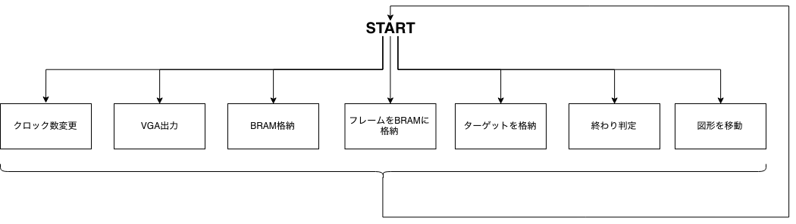
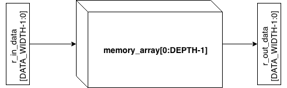
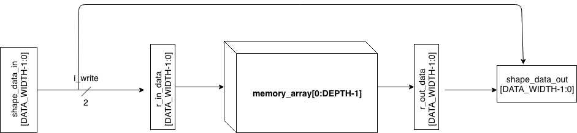
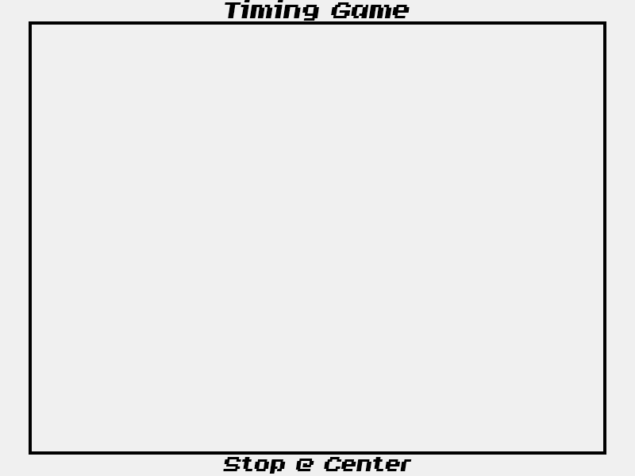

# verilog-kenpuro

東工大研究プロジェクト（吉瀬研究室）のgit

## 概要
タイミングゲームの実装  
中心にある長方形のターゲットに重なるようにストップボタンを押す、レトロなゲーム

## 最終的なゲームの様子


## 用いたハードウエア
- Nexys 4 DDA
- VGA モニタ
- Verilog

## コードの説明

ざっくりとしたフローチャートを下に示す。タイミングは微妙に異なる。



### VGA出力
吉瀬先生のコードを参考にした。  
追加で、どこを描いているのかがわかるようにx,y座標を追加した。

### BRAM実装

まず、BRAMにデータを書き込むかどうかのフラグ `i_write` を元に判断する。  
書き込む場合、 `r_in_data[DATA_WIDTH-1:0]` の中身を `memory_array[address]` に対して、書き込む。  
書き込まない場合は何も格納しない。  
しかし、常に `memory_array[address]` からデータを `r_out_data[DATA_WIDTH-1:0]` に書き込む。  
フローチャートは下記のようになる。



### 図形出力

図形出力はBRAMに図形の情報を書き込むことで実行される。この場合、現在書いてるピクセル `current_x`, `current_y` が指定した範囲`pos_x`, `pos_y` にある時だけBRAMに格納し、それ以外は何もしない実装をした。  

フローチャートは下記のようになる。  



また、背景のボードは下記のようにデザインをした。



### 経過時間計算

```
always@(posedge clk) r_tcnt <= (r_tcnt>=(40000000-1)) ? 0 : r_tcnt + 1;
always@(posedge clk) if(r_tcnt==0) r_duration <= r_duration + 1;
```
クロックを40MHzに設定をしたので、40000000クロック回った時に1秒経過したことになるので、その時に経過時間をインクリメントする。

### ポイント実装

ポイントは最大10000000点、その後は下記のような計算とした。  
`10000000 - 面積 - 1000 * 経過時間`

## 参考サイト

**Time to Explore**
- https://timetoexplore.net/blog/arty-fpga-vga-verilog-01
- https://timetoexplore.net/blog/arty-fpga-vga-verilog-02
- https://timetoexplore.net/blog/arty-fpga-vga-verilog-03

Memory File Generator:
- https://github.com/WillGreen/fpgatools
https://timetoexplore.net/
